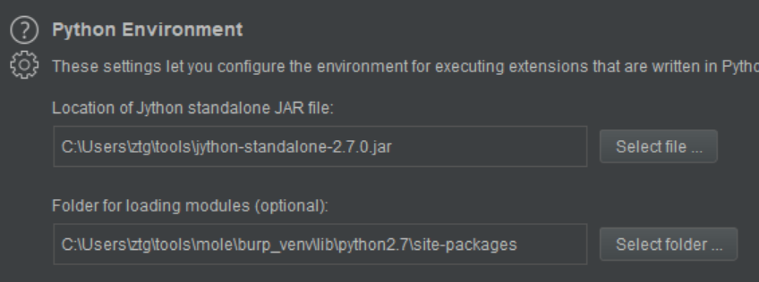
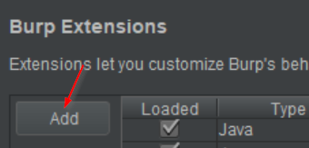
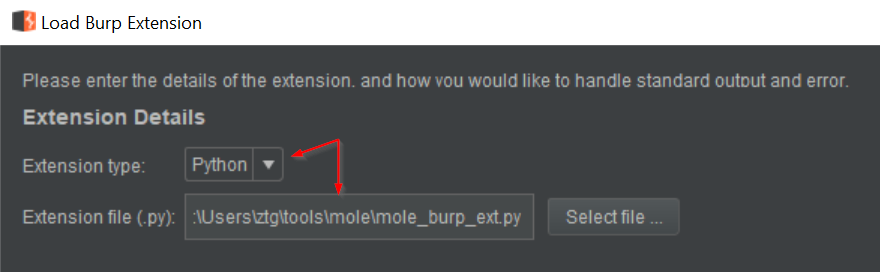
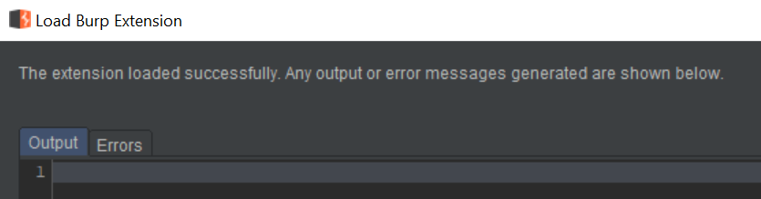

# Mole

A framework for identifying and exploiting out-of-band (OOB) vulnerabilities.

## Installation & Setup

### Mole Install

Python >= 3.6

`virtualenv -p /usr/bin/python3 venv`

`source venv/bin/activate`

`./venv/bin/pip3 install -r requirements.txt`

`git submodule update --init --recursive`

Set an API key in `config.yml` (must be the same for the client and server)

### DNS Configuration

You'll need to configure the DNS records in your registrar to point to your mole server. Minimally, you'll need an `A` record for the name server and an `NS` record configured.

Mole can be configured to host other configuration options.

#### Mailgun (Optional)

Mailgun requires DNS entries to enable the service: https://help.mailgun.com/hc/en-us/articles/203637190-How-Do-I-Add-or-Delete-a-Domain-

### TLS

Currently Mole does not support TLS natively. To implement TLS, use a reverse proxy such as [nginx](https://docs.nginx.com/nginx/admin-guide/security-controls/terminating-ssl-http/) to terminate the TLS connection and forward traffic to the Mole server.

### Burp Suite Extension

The Burp Suite Extension requires a separate Python 2.7 virtual environment due to the latest version of Jython only supporting 2.7. Below are the instructions for setting up the virtual environment and configuring the Extension.

1. Create a new python2.7 virtualenv for burp/jython, `virtualenv -p /usr/bin/python2.7 burp_venv`
2. Load the venv, `source ./burp_venv/bin/activate`
3. Install the required packages, `./burp_venv/bin/pip -r requirements`
4. Configure the Python Environment by downloading and selecting the jython-standalone jar.
5. Set the "Folder for loading modules" to the full path to `burp_venv/lib/python2.7/site-packages` that was created in steps 1-3.

4. Click Add

5. Set the Extension type to `Python` and select the `mole_burp_extension.py` file from the mole project directory.

6. Click Next and if all goes well, there will be no errors on the load screen.

## Configuration

### Token

`domain` - Your custom domain

`length` - Length of the tokens (default 5)

The token character set is ascii upper & lower, and digits. The length can be modified to meet needs such as constrained space for a payload. The number of tokens per length is listed below.

* 1 - 62
* 2 - 3844
* 3 - 238328
* 4 - 14776336
* 5 - 916132832

`ssl` - Configure payloads for `https` vs `http`

``server` - domain or IP of the Mole token server

`default_tags` - list of default tags to add to all tokens. Useful for per-project/client tokens.

### Server

`api_key` - API key used to authenticate requests to the mole API

`dns_addr` - IP address used to respond to DNS queries

`db_conn` - [SQLAlchemy](https://www.sqlalchemy.org/) [database URL](https://docs.sqlalchemy.org/en/13/core/engines.html). Default is a SQLite db in the root directory `sqlite:///mole.db`

`static_responses` - list of DNS static response key/value pairs

`web_port` - configure the listening web port

`dns_port` -configure the listening dns port

### Notifications

All notifications have an `enabled` flag that determines whether or not to trigger the notification on an interaction. Each notification plugin has its own configuration items.

`mailgun` - configure `domain`, `to`, `from`, and `api_key` to enable [mailgun](https://www.mailgun.com/) email notifications

`slack` - `token` and `channel`

`webhook` - generic POST webhook

# Issues/Bugs

I'm sure there are many, please create a new [issue](https://github.com/ztgrace/mole/issues) and fill out the template as best as you can for quick triage.